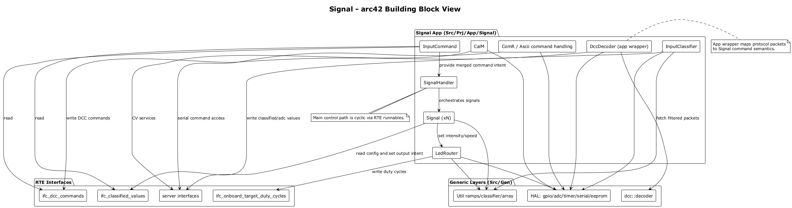
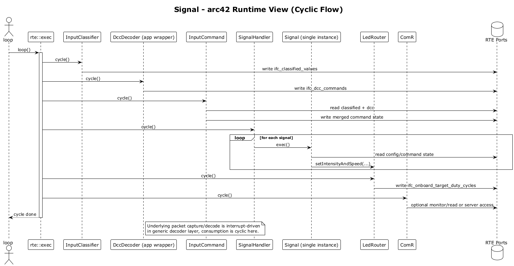
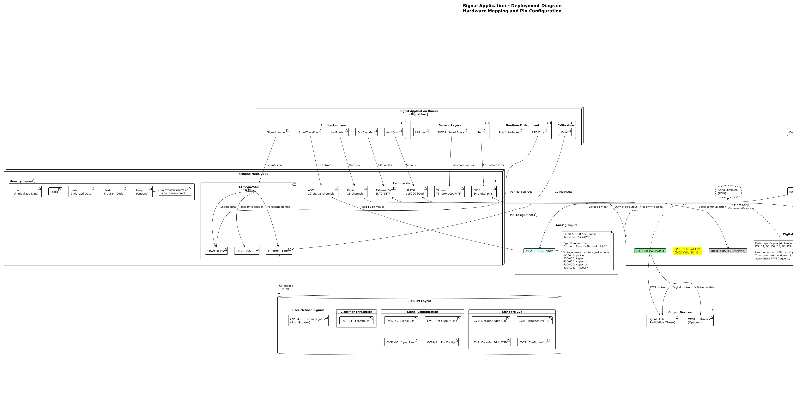

# Signal Architecture (arc42)

## 1. Introduction and Goals

The Signal application controls model railroad signals on Arduino targets, with input from ADC, digital inputs, and DCC packets.

Primary goals:

- Support multi-aspect signal control with smooth LED transitions.
- Allow runtime configuration through CVs stored in EEPROM.
- Keep runtime deterministic for embedded constraints.
- Keep communication and diagnostics available through serial ASCII commands.

## 2. Constraints

- Target platform includes resource-constrained MCUs (for example ATmega2560).
- No dynamic memory allocation in application/generic layers.
- ISR path must stay minimal and timing-safe for DCC decode reliability.
- Layered structure must be respected (`Src/Gen` reusable vs `Src/Prj` app-specific).
- RTE-driven initialization and cyclic scheduling are central integration points.

## 3. Context and Scope

In scope:

- `Src/Prj/App/Signal` application logic and integration.
- Runtime orchestration through RTE interfaces and runnables.
- DCC wrapper behavior in the Signal app.
- Serial command/configuration handling for Signal use cases.

External context:

- Hardware interfaces abstracted via HAL (GPIO, ADC, timer, serial, EEPROM).
- Generic protocol/util layers under `Src/Gen` (DCC, Util, Rte infrastructure).
- User interaction via serial terminal commands and DCC command station input.

## 4. Solution Strategy

The solution combines periodic runnables with interface-based data exchange:

- Read and classify input sources (ADC, DCC).
- Merge/route command information through RTE ports.
- Execute per-signal state behavior and map aspects to output targets.
- Use ramped LED output updates for smooth transitions.
- Persist configuration in CV-backed EEPROM via calibration manager.

The strategy intentionally separates:

- Generic capabilities in `Src/Gen` (reusable protocol/util/runtime abstractions).
- Signal-domain policies and command semantics in `Src/Prj/App/Signal`.

## 5. Building Block View

Key application blocks:

- `signal::SignalHandler`: orchestrates `cfg::kNrSignals` signals.
- `signal::Signal`: per-signal behavior and aspect execution.
- `signal::InputClassifier`: reads/classifies analog inputs and publishes classified values.
- `signal::LedRouter`: computes and applies PWM/intensity ramps.
- `signal::DccDecoder`: app-side wrapper that receives filtered DCC packets and publishes commands.
- `cal::CalM`: CV and EEPROM-backed configuration provider.
- `com::ComR` and Ascii command layer: serial command processing and diagnostics.

Key integration artifact:

- RTE object and runnable configuration in `Src/Prj/App/Signal/Rte/Rte_Cfg_Prj.h`.

Related diagrams:

- `docs/components/signal-arc42-building-block.puml`
- `docs/components/signal-architecture.puml`
- `docs/components/signal-classes.puml`

## 6. Runtime View

Runtime startup:

- `setup()` initializes serial and starts RTE.
- Init runnables initialize calibration, communication, DCC decode wrapper, classifiers, signal handler, and LED routing.

Runtime cycle:

- `loop()` calls `rte::exec()`.
- Cyclic runnables execute by configured order/period in RTE config.
- Typical flow: input classification and DCC decoding -> command/state processing -> output update -> communication/monitoring.

DCC path:

- Interrupt-driven packet capture and queueing in decoder stack.
- Signal app wrapper (`signal::DccDecoder`) consumes packets cyclically and writes command data.

Related diagrams:

- `docs/components/signal-arc42-runtime.puml`
- `docs/components/signal-sequences.puml`
- `docs/components/signal-statemachines.puml`

## 7. Deployment View

Logical deployment:

- Single firmware image running on Arduino-class target.
- Interfaces to ADC, GPIO/PWM, EEPROM, timer, and serial through HAL.
- DCC input received on configured interrupt-capable pin.

Relevant visualization:

- `docs/components/signal-deployment.puml`

## 8. Crosscutting Concepts

- Layering: reusable generic code (`Src/Gen`) vs app policy (`Src/Prj/App/Signal`).
- RTE communication: components exchange state through typed interfaces/ports.
- Calibration model: CV IDs map to configuration persisted in EEPROM.
- Deterministic processing: cyclic runnables and bounded operations.
- Testability: mirrored unit-test projects under `Src/Prj/UnitTest` with HAL stubs.

## 9. Architecture Decisions

1. Use RTE-driven runnables instead of direct component chaining.
Reason: consistent lifecycle/scheduling and clear integration seams.

2. Keep DCC low-level decoding in generic stack, use app wrapper for Signal semantics.
Reason: reuse and clean project-specific policy mapping.

3. Store configurable behavior in CVs via calibration manager.
Reason: runtime configurability and persistence across reboots.

4. Use fixed-size util containers and no heap allocation.
Reason: embedded determinism and predictable memory usage.

## 10. Quality Requirements

- Functional correctness of aspect transitions and output mapping.
- Robust DCC and ADC command handling under cyclic execution.
- Safe runtime behavior under embedded timing/memory limits.
- Maintainable separation of generic and project-specific responsibilities.
- Regression safety through unit tests and performance tests.

## 11. Risks and Technical Debt

- Risk: architecture docs can drift from code after rapid refactoring.
- Risk: DCC timing assumptions may require re-validation per hardware variation.
- Risk: command/configuration surface can grow without explicit versioning rules.
- Debt: ensure all diagrams and arc42 sections stay synchronized with current code moves.

## 12. Glossary

- Arc42: template-based software architecture documentation structure.
- CV: configuration variable (EEPROM-backed).
- DCC: Digital Command Control protocol for model railways.
- HAL: hardware abstraction layer.
- RTE: runtime environment coordinating objects and runnables.

## Section-to-Evidence Map

- Sections 1, 3: `Src/Prj/App/Signal/SignalMain.cpp`, `Src/Prj/App/Signal/Doc/Readme.md`, `docs/arc42/_context/signal-context.md`
- Sections 2, 8, 10: `CodingStyle.md`, `Src/Prj/App/Signal/Rte/Rte_Cfg_Prj.h`, `docs/arc42/_context/signal-context.md`
- Section 4: `Src/Prj/App/Signal/Signal.cpp`, `Src/Prj/App/Signal/InputClassifier.cpp`, `Src/Prj/App/Signal/LedRouter.cpp`, `docs/components/signal-arc42-building-block.puml`
- Section 5: `Src/Prj/App/Signal/Signal.h`, `Src/Prj/App/Signal/DccDecoder.h`, `Src/Prj/App/Signal/Com/ComR.cpp`, `docs/components/signal-arc42-building-block.puml`
- Section 6: `Src/Prj/App/Signal/SignalMain.cpp`, `Src/Prj/App/Signal/DccDecoder.cpp`, `Src/Prj/App/Signal/Rte/Rte_Cfg_Prj.h`, `docs/components/signal-arc42-runtime.puml`
- Section 7: `Src/Prj/App/Signal/Rte/Rte_Cfg_Prj.h`, `docs/components/signal-deployment.puml`, `docs/arc42/_context/signal-context.md`
- Section 9: `Src/Prj/App/Signal/Signal.cpp`, `Src/Prj/App/Signal/DccDecoder.cpp`, `Src/Prj/App/Signal/Cal/CalM.cpp`, `docs/arc42/_context/signal-context.md`
- Section 11: `docs/arc42/_context/signal-context.md`, `docs/arc42/_sync-log.md`

## Traceability

Primary evidence sources reviewed:

- `Src/Prj/App/Signal/SignalMain.cpp`
- `Src/Prj/App/Signal/Signal.h`
- `Src/Prj/App/Signal/Signal.cpp`
- `Src/Prj/App/Signal/InputClassifier.h`
- `Src/Prj/App/Signal/InputClassifier.cpp`
- `Src/Prj/App/Signal/LedRouter.cpp`
- `Src/Prj/App/Signal/DccDecoder.h`
- `Src/Prj/App/Signal/DccDecoder.cpp`
- `Src/Prj/App/Signal/Rte/Rte_Cfg_Prj.h`
- `Src/Prj/App/Signal/Doc/Readme.md`
- `docs/components/signal-architecture.puml`
- `docs/components/signal-arc42-building-block.puml`
- `docs/components/signal-classes.puml`
- `docs/components/signal-sequences.puml`
- `docs/components/signal-arc42-runtime.puml`
- `docs/components/signal-statemachines.puml`
- `docs/components/signal-deployment.puml`

## Open Points

- TODO: evidence required for precise ISR execution-time budget per supported target variant.
- TODO: evidence required for explicit memory budget figures per build target/profile.
- TODO: verify whether all command-handling source paths are fully reflected after recent communication refactors.
