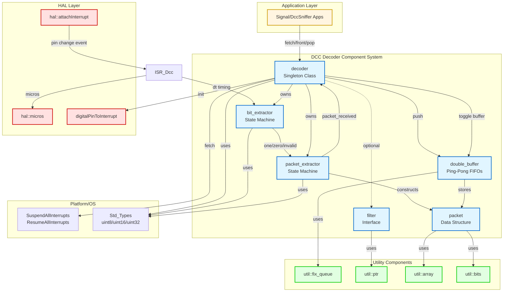
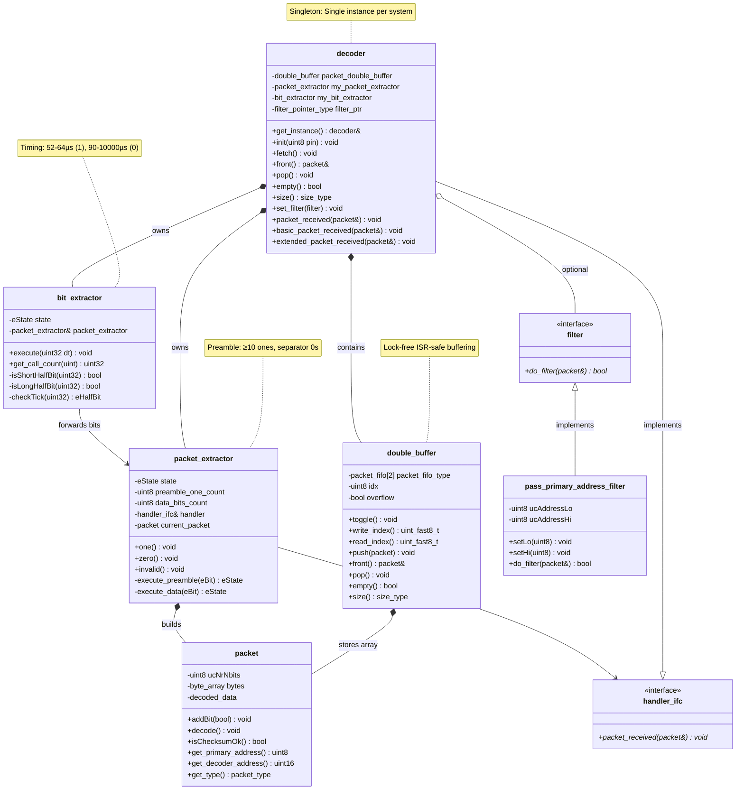

# DCC Decoder Documentation

The DCC Decoder component provides a complete implementation of NMRA Digital Command Control (DCC) signal decoding for embedded Arduino systems. It converts bipolar DCC electrical signals into structured packet data, supporting model railroad control applications with real-time performance requirements.

## 1. Component Overview

### Purpose/Responsibility

- **OVR-001**: Primary responsibility is to decode DCC electrical signals (per NMRA S-9.1) into structured packet data (per NMRA S-9.2) for use by higher-level application components
- **OVR-002**: Scope includes:
  - Interrupt-driven signal edge detection and timing measurement
  - Multi-stage decoding pipeline: half-bit timing → full bits → complete packets
  - Double-buffered FIFO for ISR-safe packet delivery to main loop
  - Optional packet filtering by address range
  - Support for all DCC packet types: Multi-Function (locomotives), Basic Accessory, Extended Accessory, Broadcast, and Idle
  - Debug instrumentation for performance monitoring
- **OVR-003**: Excluded functionality:
  - Packet interpretation/execution (delegated to application layer)
  - EEPROM/CV management (handled by calibration layer)
  - Hardware pin configuration (abstracted by HAL layer)

### System Context

The decoder sits between the Hardware Abstraction Layer (HAL) and application-specific components (e.g., Signal, DccSniffer apps). It receives raw interrupt events from the HAL's pin change interrupt handler and produces validated, typed packet structures for consumption by applications via the Runtime Environment (RTE) or direct polling.

**Key relationships**:
- **Depends on**: HAL (timer, interrupt), Platform (types), Util (containers, algorithms), OS (interrupt control)
- **Used by**: Signal application (accessory decoder), DccSniffer (diagnostic tool), test frameworks
- **Configurable via**: [DecoderCfg.h](../../Src/Gen/Dcc/DecoderCfg.h) compile-time settings (FIFO size, debug mode)

## 2. Architecture Section

### Design Patterns

- **ARC-001**: Design patterns used:
  - **Singleton Pattern**: `decoder` class provides global access via `get_instance()` - ensures single decoder per system
  - **Double Buffering**: Ping-pong packet FIFOs enable lock-free ISR-to-main-loop communication
  - **State Machine Pattern**: Both `bit_extractor` and `packet_extractor` implement explicit state machines for protocol decoding
  - **Template Method Pattern**: Virtual functions `packet_received()`, `basic_packet_received()`, `extended_packet_received()` allow derived classes to customize packet handling
  - **Chain of Responsibility**: `bit_extractor` → `packet_extractor` → `decoder` forms a processing pipeline
  - **Strategy Pattern**: `filter` interface allows pluggable packet filtering logic

### Dependencies

- **ARC-002**: Internal and external dependencies:

| Dependency | Type | Purpose |
|------------|------|---------|
| `Std_Types.h` | Platform | Fixed-width integer types (`uint8`, `uint16`, `uint32`, `boolean`) |
| `OS_Type.h` | OS Layer | Interrupt control (`SuspendAllInterrupts`, `ResumeAllInterrupts`) |
| `Hal/Timer.h` | HAL | Microsecond timing (`hal::micros()`) for half-bit duration measurement |
| `Hal/Interrupt.h` | HAL | Pin interrupt attachment (`hal::attachInterrupt()`) |
| `Dcc/BitExtractor.h` | Component | Half-bit timing classification state machine |
| `Dcc/PacketExtractor.h` | Component | Bit-to-packet assembly state machine |
| `Dcc/Filter.h` | Component | Optional packet filtering by address |
| `Dcc/Packet.h` | Component | DCC packet data structure and utilities |
| `Util/Fix_Queue.h` | Utility | Fixed-size FIFO for packet buffering |
| `Util/Ptr.h` | Utility | Non-null pointer wrapper for filter reference |

### Component Interactions

- **ARC-003**: Component interaction flow:
  1. **ISR Context**: External DCC signal edge → Hardware interrupt → `ISR_Dcc()` → `bit_extractor::execute(dt)` → `packet_extractor::one()/zero()/invalid()` → `decoder::packet_received()` → Push to write FIFO
  2. **Main Loop Context**: Application calls `decoder::fetch()` → Swaps double buffer → Application polls `decoder::empty()`, `decoder::front()`, `decoder::pop()` → Consumes packets
  3. **Optional Filtering**: If `filter` set via `set_filter()`, packets evaluated before FIFO insertion

### Component Structure and Dependencies Diagram



### Class Relationship Diagram



## 3. Interface Documentation

- **INT-001**: Public interfaces and usage patterns

### Primary Interface: `decoder` Class

| Method/Property | Purpose | Parameters | Return Type | Usage Notes |
|----------------|---------|------------|-------------|-------------|
| `get_instance()` | Singleton access | None | `decoder&` | Thread-safe static initialization |
| `init(pin)` | Initialize decoder | `uint8 pin` - Arduino pin number | `void` | Call once in setup(), attaches interrupt |
| `fetch()` | Swap double buffer | None | `void` | Call before polling packets in main loop |
| `empty()` | Check FIFO status | None | `bool` | Returns true if read FIFO is empty |
| `size()` | Get packet count | None | `size_type` | Number of packets in current read FIFO |
| `front()` | Access first packet | None | `packet&` | Reference to front packet (don't call if empty) |
| `pop()` | Remove first packet | None | `void` | Removes packet from FIFO |
| `set_filter(filter)` | Set packet filter | `const filter&` | `void` | Optional: only matching packets stored |
| `is_fifo_overflow()` | Check overflow | None | `bool` | True if write FIFO was full |
| `clear_fifo_overflow()` | Clear flag | None | `void` | Resets overflow flag |

### Extension Points (Virtual Functions)

| Method | Purpose | Override Usage |
|--------|---------|----------------|
| `packet_received(packet&)` | Called for all packets passing filter | Intercept packets before FIFO (ISR context) |
| `basic_packet_received(packet&)` | Called for basic accessory packets | Specialized handling for basic commands |
| `extended_packet_received(packet&)` | Called for extended accessory packets | Specialized handling for extended commands |
| `any_packet_received(packet&)` | Called for any packet type | Generic packet processing hook |

- **INT-002**: Configuration interface via [DecoderCfg.h](../../Src/Gen/Dcc/DecoderCfg.h):

```cpp
#define CFG_DCC_DECODER_DEBUG      OPT_DCC_DECODER_DEBUG_OFF  // Enable debug counters
#define CFG_DCC_DECODER_FIFO_SIZE  5                          // Packets per buffer
```

- **INT-003**: Event/callback mechanism: Implements `packet_extractor<>::handler_ifc` interface, receives `packet_received()` callback from packet extractor in ISR context.

## 4. Implementation Details

- **IMP-001**: Main implementation classes and responsibilities:

| Class | Responsibility | Location |
|-------|----------------|----------|
| `decoder` | Top-level coordinator, double buffering, singleton | [Decoder.h](../../Src/Gen/Dcc/Decoder.h), [Decoder.cpp](../../Src/Gen/Dcc/Decoder.cpp) |
| `bit_extractor` | Half-bit timing → full bit classification | [BitExtractor.h](../../Src/Gen/Dcc/BitExtractor.h) |
| `packet_extractor` | Bit stream → packet assembly | [PacketExtractor.h](../../Src/Gen/Dcc/PacketExtractor.h) |
| `double_buffer` | Ping-pong FIFO management | [Decoder.h](../../Src/Gen/Dcc/Decoder.h#L59-L109) (nested class) |
| `packet` | Packet data structure | [Packet.h](../../Src/Gen/Dcc/Packet.h) |
| `filter` | Address-based filtering | [Filter.h](../../Src/Gen/Dcc/Filter.h) |

- **IMP-002**: Configuration and initialization:

```cpp
// In setup()
dcc::decoder& dec = dcc::decoder::get_instance();
dec.init(2);  // Attach to digital pin 2

// Optional: filter for accessory decoder addresses 128-191
dcc::pass_primary_address_filter<dcc::packet<>> filter(128, 191);
dec.set_filter(filter);
```

- **IMP-003**: Key algorithms:

**Half-bit Timing Classification** (NMRA S-9.1):
```cpp
// In bit_extractor::checkTick()
if (52µs ≤ dt ≤ 64µs)  → SHORT_HALFBIT  // "1" bit half
if (90µs ≤ dt ≤ 10ms)  → LONG_HALFBIT   // "0" bit half
else                   → INVALID_HALFBIT
```

**Bit Assembly State Machine** (`bit_extractor`):
- 9-state machine tracks half-bit phase synchronization
- Two consecutive SHORT_HALFBITs → `one()` event
- Two consecutive LONG_HALFBITs → `zero()` event
- Invalid timing → `invalid()` event, state reset

**Packet Extraction** (`packet_extractor`):
- **PREAMBLE state**: Count consecutive "1" bits, require ≥10 (configurable)
- **DATA state**: Bit 0-7 = data byte, bit 8 = separator
  - Separator "0" → more bytes
  - Separator "1" → end of packet, call `packet_received()`

**Double Buffering**:
```cpp
// ISR writes to buffer[idx]
void push(packet) {
    packet_fifo[write_index()].push(pkt);
}

// Main loop toggles: fetch() swaps idx, reads from buffer[1-idx]
void fetch() {
    SuspendAllInterrupts();
    idx = 1 - idx;
    ResumeAllInterrupts();
}
```

- **IMP-004**: Performance characteristics:

| Metric | Value | Notes |
|--------|-------|-------|
| ISR execution time | 34µs @ 16MHz (-O3) | Must be <26µs for 52µs half-bit tolerance |
| ISR execution time | 52µs @ 16MHz (-Os) | Size-optimized, marginal timing |
| ISR code size | 1342 bytes (-O3) | Speed-optimized |
| ISR code size | 370 bytes (-Os) | Size-optimized |
| Packet rate | ~150/sec | 3-byte packet, 16-bit preamble |
| FIFO size | 5 packets/buffer (default) | Configurable via `CFG_DCC_DECODER_FIFO_SIZE` |
| Memory usage | ~200 bytes RAM | Two FIFOs + state machines |

**Critical**: ISR must complete in <26µs (half of shortest valid half-bit: 52µs). Use `-O3` optimization for ATmega2560. `-Os` (52µs) is marginal.

## 5. Usage Examples

### Basic Usage

```cpp
#include <Dcc/Decoder.h>

void setup() {
    Serial.begin(115200);
    
    // Initialize decoder on pin 2
    dcc::decoder& dec = dcc::decoder::get_instance();
    dec.init(2);
}

void loop() {
    dcc::decoder& dec = dcc::decoder::get_instance();
    
    // Fetch new packets from ISR buffer
    dec.fetch();
    
    // Process all available packets
    while (!dec.empty()) {
        dcc::packet<>& pkt = dec.front();
        
        // Decode packet to determine type and address
        pkt.decode();
        
        // Access packet data
        uint16 addr = pkt.get_decoder_address();
        auto type = pkt.get_type();
        
        Serial.print("Address: ");
        Serial.print(addr);
        Serial.print(" Type: ");
        Serial.println(static_cast<int>(type));
        
        // Remove processed packet
        dec.pop();
    }
    
    delay(10);
}
```

### Advanced Usage: Custom Packet Handler

```cpp
class MyDecoder : public dcc::decoder {
public:
    // Override to intercept packets in ISR context
    void packet_received(packet_type& pkt) override {
        // Apply filter first
        bool process = true;
        if (filter_ptr && !filter_ptr->do_filter(pkt)) {
            process = false;
        }
        
        if (process) {
            // Custom processing
            pkt.decode();
            if (pkt.get_type() == packet_type::BasicAccessory) {
                // Handle immediately for low latency
                handle_accessory(pkt);
            }
            
            // Still push to FIFO for main loop
            packet_double_buffer.push(pkt);
        }
    }
    
private:
    void handle_accessory(const packet_type& pkt) {
        // Time-critical accessory handling
    }
};
```

### Advanced Usage: Address Filtering

```cpp
void setup() {
    dcc::decoder& dec = dcc::decoder::get_instance();
    dec.init(2);
    
    // Only accept accessory decoder packets (addresses 128-191)
    static dcc::pass_primary_address_filter<dcc::packet<>> acc_filter(128, 191);
    dec.set_filter(acc_filter);
}

void loop() {
    dcc::decoder& dec = dcc::decoder::get_instance();
    dec.fetch();
    
    // Only accessory packets present
    while (!dec.empty()) {
        // Process accessory commands...
        dec.pop();
    }
}
```

### Debug Mode Usage

```cpp
// In DecoderCfg.h: #define CFG_DCC_DECODER_DEBUG OPT_DCC_DECODER_DEBUG_ON

void loop() {
    dcc::decoder& dec = dcc::decoder::get_instance();
    
    // Monitor decoder statistics
    Serial.print("ISR Count: ");
    Serial.println(dec.get_interrupt_count());
    
    Serial.print("Packets: ");
    Serial.println(dec.get_packet_count());
    
    Serial.print("Ones: ");
    Serial.print(dec.get_ones_count());
    Serial.print(" Zeros: ");
    Serial.print(dec.get_zeros_count());
    Serial.print(" Invalids: ");
    Serial.println(dec.get_invalids_count());
    
    // Check for overflow
    if (dec.is_fifo_overflow()) {
        Serial.println("WARNING: FIFO overflow!");
        dec.clear_fifo_overflow();
    }
    
    delay(1000);
}
```

- **USE-003**: Best practices:
  - Call `fetch()` at regular intervals (≤50ms) to prevent FIFO overflow
  - Use `-O3` compiler optimization for ISR timing compliance
  - Keep filter logic simple (evaluated in ISR context)
  - Always check `empty()` before calling `front()`
  - Call `decode()` on packets before accessing type/address fields
  - Monitor `is_fifo_overflow()` in debug builds to tune FIFO size

## 6. Quality Attributes

### Security

- **QUA-001**: 
  - **Input Validation**: All timing values validated against NMRA S-9.1 thresholds before processing
  - **Overflow Protection**: Double buffer includes overflow flag, prevents silent packet loss
  - **Buffer Bounds**: `util::fix_queue` provides compile-time size limits, no dynamic allocation
  - **Interrupt Safety**: Critical sections protected by `SuspendAllInterrupts()`/`ResumeAllInterrupts()`

### Performance

- **QUA-002**:
  - **Real-time Compliance**: ISR execution 34µs @ 16MHz meets 26µs deadline (with margin)
  - **Deterministic Behavior**: No dynamic memory, fixed execution paths, bounded FIFO size
  - **Scalability**: Handles ~150 packets/sec (NMRA maximum rate)
  - **Resource Usage**: 
    - RAM: ~200 bytes (2 FIFOs × 5 packets × 6 bytes + overhead)
    - Flash: ~2KB (decoder + extractors + utilities)
    - CPU: 34µs ISR + negligible main loop overhead
  - **Optimization**: Template-based design enables compile-time specialization

### Reliability

- **QUA-003**:
  - **Error Handling**: 
    - Invalid half-bit timings → state machine reset, not a crash
    - Checksum validation available via `packet::isChecksumOk()`
    - Overflow detection with `is_fifo_overflow()` flag
  - **Fault Tolerance**: 
    - State machine auto-recovers from electrical noise by resetting to INVALID state
    - Double buffering prevents data corruption between ISR and main loop
  - **Recovery**: Decoder continuously processes incoming signal, no manual reset needed
  - **Robustness**: Tolerates NMRA-specified jitter and asymmetry (±6µs per S-9.1)

### Maintainability

- **QUA-004**:
  - **Coding Standards**: Follows project [CodingStyle.md](../../CodingStyle.md) (snake_case, namespaces, Doxygen)
  - **Testing**: Unit tests in [Src/Prj/UnitTest/Gen/Dcc/](../../Src/Prj/UnitTest/Gen/Dcc/) (Ut_Packet, Ut_Filter, Ut_PacketExtractor)
  - **Documentation**: Comprehensive Doxygen comments in all headers
  - **Modularity**: Clear separation: timing → bits → packets → application
  - **No Dependencies**: No STL, no heap, no RTTI, no exceptions (embedded-friendly)

### Extensibility

- **QUA-005**:
  - **Extension Points**:
    - Virtual `packet_received()` for custom packet interception
    - Template parameters for timing constants (`bit_extractor_constants`)
    - Template parameter for minimum preamble length (`packet_extractor<PreambleMinNrOnes>`)
    - `filter` interface for custom filtering strategies
  - **Customization**:
    - Compile-time FIFO size via `CFG_DCC_DECODER_FIFO_SIZE`
    - Debug mode via `CFG_DCC_DECODER_DEBUG`
    - Timing thresholds via `bit_extractor_constants<>` template
  - **Examples**: 
    - Signal app extends `decoder` to implement accessory decoder protocol
    - DccSniffer uses base decoder for diagnostic packet capture

## 7. Reference Information

### Dependencies

- **REF-001**: Complete dependency list with versions:

| Dependency | Version/Source | Purpose |
|------------|----------------|---------|
| AVR-GCC | 7.3.0+ | Compiler toolchain for AVR targets |
| Arduino Core | 1.8.0+ | Hardware abstraction (HAL wraps this) |
| NMRA Standards | S-9.1 (2012), S-9.2.1 (2025) | DCC protocol specification |
| GnuWin32 Make | 3.81+ | Build system (Windows) |
| Platform/Std_Types.h | Project | Fixed-width types (`uint8`, `uint16`, `uint32`) |
| Util/Fix_Queue.h | Project | Fixed-size FIFO container |
| Hal/Timer.h | Project | `hal::micros()` timing function |
| Hal/Interrupt.h | Project | `hal::attachInterrupt()` pin setup |

### Configuration Options

- **REF-002**: Complete configuration reference:

```cpp
// DecoderCfg.h

// Enable debug counters (packet count, ISR count, bit counts)
// Values: OPT_DCC_DECODER_DEBUG_ON, OPT_DCC_DECODER_DEBUG_OFF
#define CFG_DCC_DECODER_DEBUG      OPT_DCC_DECODER_DEBUG_OFF

// Number of packets per FIFO buffer (two buffers total)
// Range: 3-10 (higher = more RAM, lower overflow risk)
#define CFG_DCC_DECODER_FIFO_SIZE  5

// Timing constants (via template parameters)
// bit_extractor_constants<ShortMin, ShortMax, LongMin, LongMax>
// Defaults: 48µs, 68µs, 86µs, 10000µs (margins added to NMRA spec)
```

### Testing Guidelines

- **REF-003**: Testing approach:

**Unit Tests**:
- Location: [Src/Prj/UnitTest/Gen/Dcc/](../../Src/Prj/UnitTest/Gen/Dcc/)
- Framework: Unity (cross-platform)
- Tests:
  - `Ut_Packet`: Packet construction, decoding, checksum validation
  - `Ut_Filter`: Address range filtering logic
  - `Ut_PacketExtractor`: Bit-to-packet assembly state machine
  - `Ut_Signal_Performance`: End-to-end decoder throughput

**Integration Tests**:
- DccSniffer application: Real-world signal capture and analysis
- Signal application: Accessory decoder protocol compliance

**Mock Setup**:
```cpp
// Stub HAL functions for unit tests
#include <Hal/Timer.h>
uint32 hal::stub_micros_return = 0;  // Control timing in tests

// In test
hal::stub_micros_return = 58;  // Simulate "1" bit half-time
decoder.get_bit_extractor().execute(58);
```

**Build and Run**:
```bash
# Windows unit tests
Build/build.bat UnitTest/Gen/Dcc/Ut_Packet win32 gcc win unity run

# Arduino hardware tests
Build/build.bat UnitTest/Gen/Dcc/Ut_Packet mega avr_gcc arduino unity download
```

### Troubleshooting

- **REF-004**: Common issues and solutions:

| Issue | Error/Symptom | Solution |
|-------|---------------|----------|
| No packets received | `empty()` always true | Check pin connection, verify DCC signal present, confirm `init(pin)` called |
| FIFO overflow | `is_fifo_overflow()` returns true | Increase `CFG_DCC_DECODER_FIFO_SIZE`, call `fetch()` more frequently (≤50ms) |
| ISR timing violation | Decoder misses bits, corrupt packets | Use `-O3` optimization, verify 16MHz clock, simplify filter logic |
| Invalid packet type | `get_type()` returns `Unknown` | Call `decode()` after `front()`, check packet checksum with `isChecksumOk()` |
| Address mismatch | Filter not working | Verify filter address range, ensure `set_filter()` called before packets arrive |
| Compilation error | `operator delete` undefined | Do not use virtual destructors, follow project patterns (no dynamic allocation) |

**Error Messages**:
- **"undefined reference to `operator delete(void*, unsigned int)`"**: Remove virtual destructor, use default destructor
- **"no matching function for call to 'decoder::decoder()'"**: decoder is singleton, use `get_instance()` not constructor

### Related Documentation

- **REF-005**: Additional resources:

| Document | Location | Description |
|----------|----------|-------------|
| Project README | [README.md](../../README.md) | Project overview, build instructions |
| Coding Style Guide | [CodingStyle.md](../../CodingStyle.md) | Naming conventions, patterns, restrictions |
| DCC Protocol Specs | https://www.nmra.org | NMRA S-9.1 (electrical), S-9.2 (packets), S-9.2.1 (accessory) |
| Signal App Docs | [Src/Prj/App/Signal/Doc/Readme.md](../../Src/Prj/App/Signal/Doc/Readme.md) | Accessory decoder implementation example |
| HAL Documentation | [Src/Gen/Hal/](../../Src/Gen/Hal/) | Platform abstraction layer APIs |
| Util Library Docs | [Src/Gen/Util/](../../Src/Gen/Util/) | Embedded STL alternatives |
| Doxygen Output | `Build/Doc/html/index.html` | Generated API documentation (run `doxygen Doxyfile`) |

### Change History

- **REF-006**: Version history:

| Version | Date | Changes | Migration Notes |
|---------|------|---------|-----------------|
| 1.0 | 2025-01 | Initial stable release | - Updated to NMRA S-9.2.1 (2025) accessory addressing<br/>- Optimized ISR timing (34µs @ -O3)<br/>- Added overflow detection |
| 0.9 | 2023 | Beta release | - Implemented double buffering<br/>- Added filter support<br/>- Debug instrumentation |
| 0.1 | 2018 | Initial implementation | - Basic bit/packet extraction<br/>- Single FIFO buffer |

**Breaking Changes**: None in 1.0 (compatible with 0.9)

**Migration from 0.9**:
- No code changes required
- Recommended: Enable overflow monitoring with `is_fifo_overflow()`
- Consider increasing FIFO size if overflow occurs

---

## Additional Technical Notes

### NMRA DCC Protocol Summary

**Electrical Specification (S-9.1)**:
- Bipolar square wave, bits encoded by zero-crossing timing
- "1" bit: 52-64µs per half (nominal 58µs), asymmetry ≤6µs
- "0" bit: 90-10,000µs per half (nominal ≥100µs)
- Decoder must tolerate jitter within ranges

**Packet Structure (S-9.2)**:
```
{preamble} 0 ADDRESS 0 INSTRUCTION 0 DATA... 0 CHECKSUM 1
```
- Preamble: ≥10 consecutive "1" bits (typically 16)
- Separators: "0" bit after preamble and each data byte
- End marker: "1" bit after checksum

**Address Ranges**:
- 0: Broadcast
- 1-127: Multi-Function 7-bit (locomotives)
- 128-191: Basic/Extended Accessory decoders
- 192-231: Multi-Function 14-bit (locomotives)
- 232-254: Reserved
- 255: Idle packet

### Performance Tuning

**ISR Optimization**:
```bash
# Speed-critical (recommended)
CFLAGS += -O3  # 34µs ISR execution

# Size-critical (marginal timing)
CFLAGS += -Os  # 52µs ISR execution (use only if flash constrained)
```

**FIFO Sizing**:
- Default 5 packets/buffer = 10 packets total RAM
- Typical packet rate: 150/sec = 6.67ms/packet
- 50ms fetch interval → expect ~7-8 packets → use 10+ FIFO size
- Formula: `FIFO_SIZE ≥ (fetch_interval_ms / 6.67) + 2` (margin)

**Example**:
```cpp
// For 100ms fetch interval (not recommended)
#define CFG_DCC_DECODER_FIFO_SIZE  17  // (100/6.67)+2 = ~17
```

### Platform-Specific Notes

**AVR (Arduino Mega/Nano)**:
- 16MHz clock required for accurate timing
- Use hardware pin change interrupts (pins 2, 3 on Mega)
- ISR stack usage: ~40 bytes (verify with `-fstack-usage`)

**Cross-Platform Testing (Windows/Linux)**:
- HAL provides stub implementations for `hal::micros()`, `hal::attachInterrupt()`
- Unit tests run natively for fast iteration
- Performance tests use `rdtsc` instruction for cycle counting

### Code Size Analysis

```bash
# Generate size breakdown
avr-size -A -d Build/Bin/Signal/mega/Signal.elf

# Symbol sizes (top 20)
avr-nm --size-sort --radix=d Build/Bin/Signal/mega/Signal.elf | tail -20

# Per-function size
avr-objdump -h Build/Bin/Signal/mega/Signal.elf
```

Typical breakdown:
- decoder: ~400 bytes
- bit_extractor: ~500 bytes
- packet_extractor: ~600 bytes
- packet: ~400 bytes
- Total: ~2KB flash, ~200 bytes RAM
